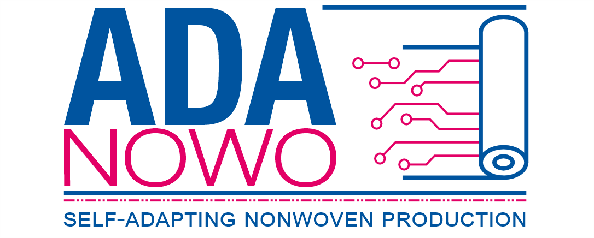

# adanowo_simulator: A Python Library for Simulating Nonwoven Production Environments 
This project is meant for testing and validationg smart production planning agents in a simulated nonwoven production environment.



## Description

This project serves as a simulation tool for nonwovens production, targeting the textile industry — a sector of ongoing relevance in Europe. 
Designed to overcome the challenges of incomplete optimization problem formulations and not reproducible results of many research works, the simulator serves as a robust platform for testing various agent algorithms for process optimization.

### Key Features:

- **Data-Driven**: Utilizes machine learning models trained on industrial data, alongside physically motivated models, for accurate simulation.
- **Modular and Adaptable**: Built using Python 3.10, the project is highly modular and allows for comprehensive and reproducible testing of different optimization approaches.
- **Economical & Technical**: Captures both the economic and technical aspects of production, thereby offering a 'simulation-first' approach for cheap testing before physical trials.

By integrating advanced data-driven methods, this simulation tool aims to reduce waste, increase profitability, and alleviate the workload of staff in the textile industry. 
The project is set to contribute to ongoing research in production process optimization.


## Installation

### Prerequisites:
- Python 3.10.4 or higher
- (optional) a fresh virtual environment
- [Poetry](https://python-poetry.org/docs/) is already preinstalled. 
Under Windows you might need to use pip to install poetry if the command from the website doesn't work.
- CUDA 11.7 (Optional but highly recommended for better performance)

### Steps:

1. Clone the repository:
   ```bash
   git clone https://git.rwth-aachen.de/ruben.kins/adanowo-simulator.git

2. Change to the project directory:
   ```bash
   cd adanowo-simulator

3. Install the required packages using Poetry:
   ```bash
   poetry install
   
4. Note: The Poetry command will install the project in editable mode. If you want to install the project as a regular, package, use the following command afterwards (specifying the version number):
   ```bash
   pip install .\dist\adanowo_simulator-x.x.x.tar.gz

## Usage
Once you've installed all prerequisites and dependencies, you're ready to run the project.

### Logging with WandB
 This project also uses [Weights and Biases](https://wandb.ai/site) for logging and visualization.
Make sure you have setup an account before so you can enter your credentials on the first run. 
Alternatively, you can disable logging or use a different logger by writing your own simple logger module.

### Configuration with Hydra
This project uses Hydra for configuration management. Configuration files can be found in the `config` folder. 
You can customize the run by modifying these configuration files or by passing parameters through the command line. 
For more information on how to use Hydra, refer to their [documentation](https://hydra.cc/docs/intro/).
The config folder will not be installed by poetry, its is meant to be used by the calling script. 
Use the existing configuration as a template for your own tests.

### Example Usage
A detailed example can be found in `./examples/example.py`. 
The example script demonstrates how to use the `EnvironmentFactory` and `GymWrapper` to initialize and step through an environment.
A simple random agent is used in the example. For adapting the code to arbitrary agents, you need to write your own wrapper file.


## Modifications
The environment in this project is designed to be highly modular, allowing you to easily extend or modify its functionalities. 
Abstract base classes with detailed docstrings are provided to serve as a template for creating new modules.


To write your own module, start by examining the abstract base classes provided in the `abstract_base_classes` directory. 
Each abstract base class contains thorough docstrings explaining its purpose and how to implement its methods.


## Reference to Academic Paper

This software project is part of the broader research initiative "adanowo".
A comprehensive research paper discussing the methodologies, models, and results has been published. 
We strongly recommend reading the paper for a more in-depth understanding of the algorithms and techniques implemented here.

### Citation

You can cite this project and the associated paper as follows:

#### APA Style
*To be updated upon publication*

#### IEEE Style
*To be updated upon publication*

For more detailed information, please refer to the research paper or contact the author under ruben.kins@rwth-aachen.de.